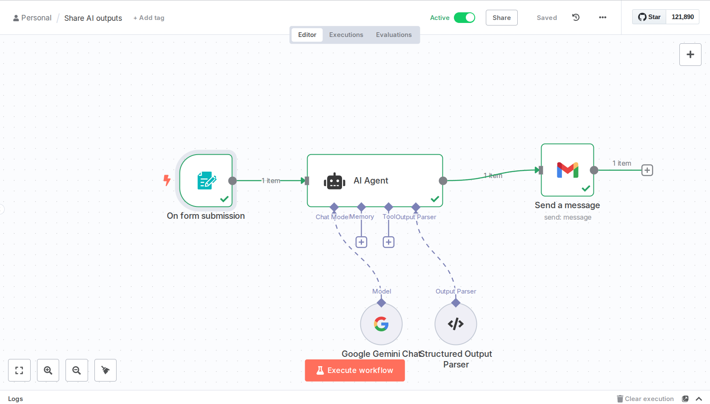
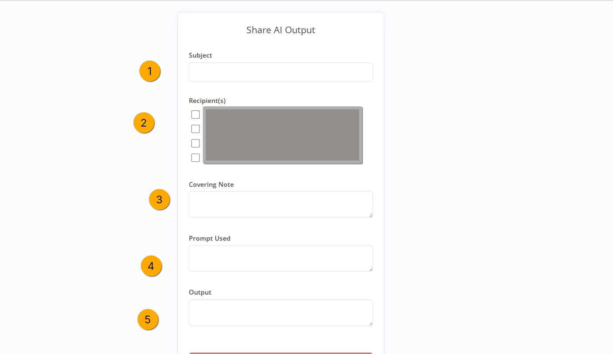

# Email AI Outputs Workflow

A N8N configured workflow for sharing AI-generated content with friends and family through a streamlined form-to-email process.

## Overview

This workflow enables you to easily share AI outputs (like ChatGPT responses) with your network by:
1. Capturing content through a form trigger
2. Processing and formatting the AI output for email delivery
3. Automatically sending beautifully formatted emails to recipients

## Workflow Components

### 1. Form Trigger
The workflow starts with a form submission event that captures:
- AI-generated content (typically from ChatGPT or similar)
- Covering note/context
- Recipient information

### 2. Content Formatting Agent
A specialized reformatting step that:
- Converts markdown content to Gmail-safe HTML
- Ensures proper rendering across email clients
- Optimizes tables and formatting for email delivery
- Uses an AI agent with specific instructions for email-compatible HTML generation

### 3. Email Delivery
The final step sends the formatted content to recipients using a professional email template.

## Files in this Repository

- **`template.html`** - Email template with professional styling and responsive design
- **`reformatter.md`** - Documentation and configuration for the AI formatting agent
- **`screenshots/`** - Visual documentation of the workflow setup

## Key Features

- **Gmail-Safe Formatting**: Specialized HTML conversion ensures content renders properly in Gmail and other email clients
- **Professional Template**: Clean, responsive email design with proper styling
- **Automated Processing**: No manual intervention required once the form is submitted
- **Flexible Content**: Handles various types of AI outputs including text, tables, and formatted content

## Technical Details

### Reformatting Agent
The reformatting step uses a custom AI agent configured with:
- System prompt optimized for email HTML conversion
- JSON schema for structured output
- Special handling for markdown tables and complex formatting
- Gmail compatibility focus

### Email Template
The HTML template features:
- Responsive design (600px width)
- Professional styling with Segoe UI font
- Structured layout with header, body, and footer sections
- Inline CSS for maximum email client compatibility

## Setup Requirements

1. **N8N Instance**: Running N8N automation platform
2. **Email Service**: Configured email sending capability in N8N
3. **AI Service**: Access to an AI service (like OpenAI) for the reformatting agent
4. **Form Endpoint**: Web form or webhook trigger configured in N8N

## Usage

1. Submit content through the configured form
2. The workflow automatically processes and formats the content
3. Recipients receive a professionally formatted email with the AI output
4. No manual intervention required

 